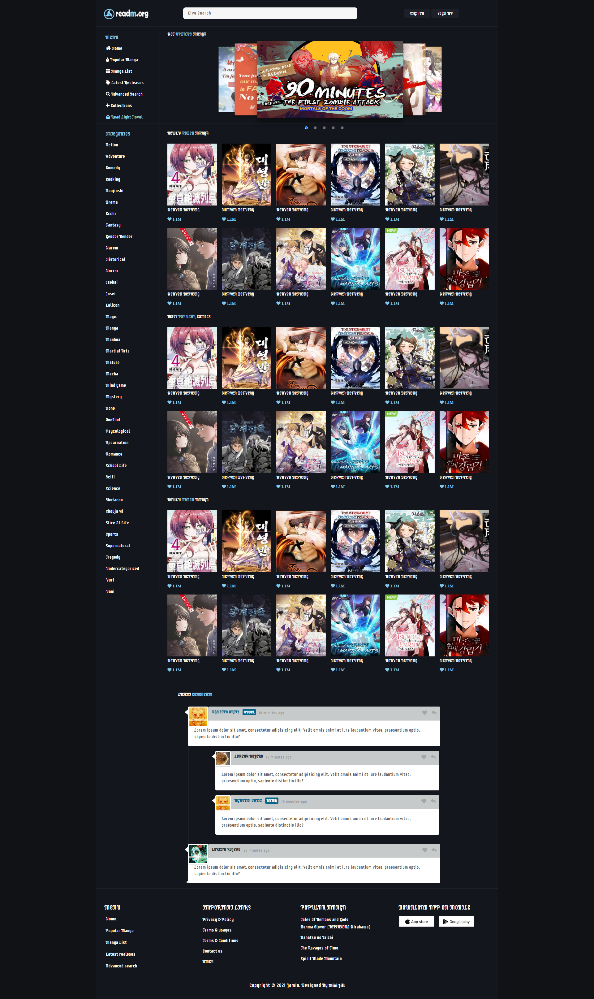
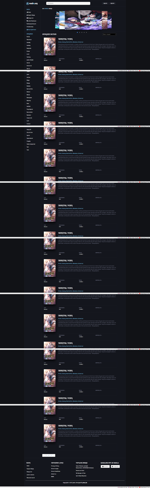

 📖 ReadM-Org — Manga Reading Website

[ReadM-Org](https://readmeorg.netlify.app/) is a modern, responsive manga reading website built with **HTML5**, **CSS3**, and **Bootstrap 5**.  
It provides a clean and visually appealing layout for manga readers to browse categories, view chapters, and discover popular manga titles.

---

## 🌐 Demo

You can open the project locally by running:

```bash
index.html
```

---

## 🛠️ Built With

- **HTML5** – for structured markup
- **CSS3** – for custom styling and layout
- **Bootstrap 5** – for responsive design and grid system
- **Google Fonts** – `Supermercado One`
- **Font Awesome** – for icons

---

## 📁 Project Structure

```
readm-org/
│
├── index.html            # Home page (featured manga, categories, popular comics)
├── category.html         # Manga category page (lists manga by genre)
├── chapter.html          # Manga chapter page (shows chapters and manga details)
│
├── css/
│   ├── style.css         # Main styling file
│   └── responsive.css    # Responsive adjustments for mobile/tablet
│
├── img/                  # All images, logos, and category thumbnails
└── README.md             # Project documentation
```

---

## 🎨 Features

✅ **Responsive Layout** – Adapts to all screen sizes using Bootstrap 5.  
✅ **Manga Slider** – Image slider showcasing trending manga.  
✅ **Live Search Bar** – Search input placeholder for user interaction.  
✅ **Category Sidebar** – Genre-based manga filtering.  
✅ **Modern UI Design** – Dark theme with accent colors for readability.  
✅ **Manga Info Cards** – Display manga cover, title, rating, and description.  
✅ **Footer Section** – Clean footer with copyright.

---

---

## 🧩 Challenges Faced

### 💬 Comments UI

Designing the comment section to look clean and structured while keeping it readable on dark backgrounds was a challenge.  
Creating nested reply threads with borders, avatar alignment, and responsive text spacing required careful layout testing.

### 📱 Mobile Responsiveness

Ensuring a smooth layout for mobile devices was tricky — particularly with the image slider and manga grid system.  
Bootstrap’s grid helped, but custom CSS was added to improve spacing, image resizing, and stacking behavior for smaller screens.

---

---

### 🧠 Lessons Learned

- Throughout this project, I learned several valuable lessons:

- The importance of responsive design planning from the start — especially when working with complex grids and sliders.

- How to balance Bootstrap’s defaults with custom CSS for a unique visual identity.

- Techniques for improving UI readability on dark themes, including color contrast and typography choices.

- Structuring HTML and CSS in a modular and scalable way for easier maintenance.

## Understanding how user experience (UX) improves when small details like padding, hover effects, and font sizes are consistent across devices

## 🖋️ How to Use

1. **Clone or download** the repository.
   ```bash
   git clone https://github.com/your-username/readm-org.git
   ```
2. **Open** `index.html` in any web browser.
3. Navigate through the site using links to `category.html` and `chapter.html`.

---

## 📱 Responsive Design

This project includes a fully responsive design supporting:

- **Mobile devices** (max-width: 480px)
- **Tablets** (481px to 767px)
- **Laptops and Desktops** (768px and above)

---

## 🧩 External Resources

- [Bootstrap 5](https://getbootstrap.com/)
- [Font Awesome](https://fontawesome.com/)
- [Google Fonts – Supermercado One](https://fonts.google.com/specimen/Supermercado+One)

---

## 📸 Preview

  


---

## 👨‍💻 Author

**Syed Minoar Hasan**

- Email: [minoarhasan@gmail.com]
- Github: [@Syed Minoar Hasan](https://github.com/Minoar98)
- LinkedIn: [Syed Minoar Hasan](https://www.linkedin.com/in/syed-minaor-hasan-3404b617a/)

🌍 Passionate about problem-solving and frontend development.

---
